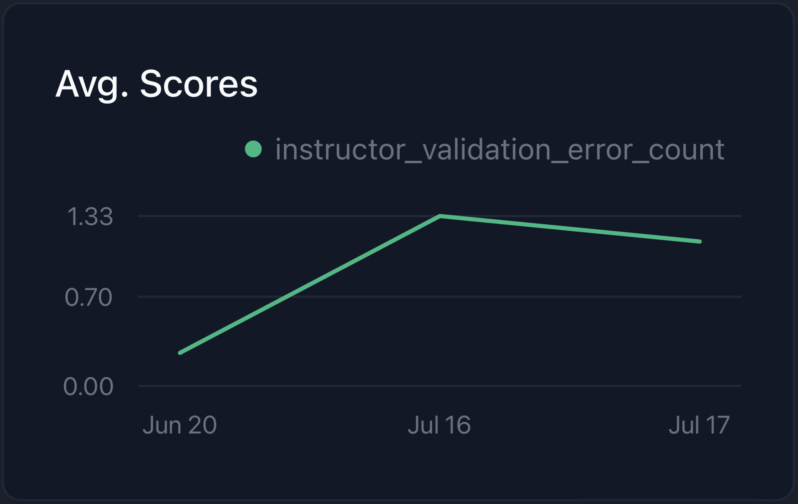

# Parea for Observing, Testing & Fine-tuning of Instructor

[Parea](https://www.parea.ai) is a platform that enables teams to monitor, collaborate, test & label for LLM applications. In this blog we will explore how Parea can be used to enhance the OpenAI client alongside `instructor` and debug + improve `instructor` calls. Parea has some features which makes it particularly useful for `instructor`:

- it automatically groups any LLM calls due to reties under a single trace
- it automatically tracks any validation error counts & fields that occur when using `instructor`
- it provides a UI to label JSON responses by filling out a form instead of editing JSON objects

??? info "Configure Parea"

    Before starting this tutorial, make sure that you've registered for a [Parea](https://www.parea.ai) account. You'll also need to create an [API key](https://docs.parea.ai/api-reference/authentication).


## Example: Writing Emails with URLs from Instructor Docs

We will demonstrate Parea by using `instructor` to write emails which only contain URLs from the `instructor` docs. We'll need to install our dependencies before proceeding so simply run the command below. 

```bash
pip install -U parea-ai instructor
```

Parea is dead simple to integrate - all it takes is 2 lines of code, and we have it setup.

```python hl_lines="9 15-16"
import os

import instructor
import requests
from dotenv import load_dotenv
from openai import OpenAI
from pydantic import BaseModel, field_validator, Field
import re
from parea import Parea #(1)!

load_dotenv()

client = OpenAI()

p = Parea(api_key=os.getenv("PAREA_API_KEY")) #(2)!
p.wrap_openai_client(client, "instructor")

client = instructor.from_openai(client)
```

1. Import `Parea` from the `parea` module
2. Setup tracing using their native integration with `instructor`

In this example, we'll be looking at writing emails which only contain links to the instructor docs. To do so, we can define a simple Pydantic model as seen below.

```python
class Email(BaseModel):
    subject: str
    body: str = Field(
        ...,
        description="Email body, Should contain links to instructor documentation. ",
    )

    @field_validator("body")
    def check_urls(cls, v):
        urls = re.findall(r"https?://(?:[-\w.]|(?:%[\da-fA-F]{2}))+", v)
        errors = []
        for url in urls:
            if not url.startswith("https://python.useinstructor.com"):
                errors.append(
                    f"URL {url} is not from useinstructor.com, Only include URLs that include use instructor.com. "
                )
            response = requests.get(url)
            if response.status_code != 200:
                errors.append(
                    f"URL {url} returned status code {response.status_code}. Only include valid URLs that exist."
                )
            elif "404" in response.text:
                errors.append(
                    f"URL {url} contained '404' in the body. Only include valid URLs that exist."
                )
        if errors:
            raise ValueError("\n".join(errors))
        return
```

Now we can proceed to create an email using above Pydantic model.

```python hl_lines="5-14"
email = client.messages.create(
    model="gpt-3.5-turbo",
    max_tokens=1024,
    max_retries=3,
    messages=[ #(1)!
        {
            "role": "user",
            "content": "I'm responding to a student's question. Here is the link to the documentation: {{doc_link1}} and {{doc_link2}}",
        }
    ],
    template_inputs={
        "doc_link1": "https://python.useinstructor.com/docs/tutorial/tutorial-1",
        "doc_link2": "https://jxnl.github.io/docs/tutorial/tutorial-2",
    },
    response_model=Email,
)
print(email)
```

1. Parea supports templated prompts via `{{...}}` syntax in the `messages` parameter. We can pass the template inputs as a dictionary to the `template_inputs` parameter.

If you follow what we've done, Parea has wrapped the client, and we wrote an email with links from the instructor docs.

## Validation Error Tracking

To take a look at trace of this execution checkout the screenshot below. Noticeable:

- left sidebar: all related LLM calls are grouped under a trace called `instructor`
- middle section: the root trace visualizes the `templated_inputs` as inputs and the created `Email` object as output
- bottom of right sidebar: any validation errors are captured and tracked as score for the trace which enables visualizing them in dashboards and filtering by them on tables


Above we can see that while the email was successfully created, there was a validation error which meant that additional cost & latency were introduced because of the initially failed validation.
Below we can see a visualization of the average validation error count for our instructor usage over time.




## Label Responses for Fine-Tuning

Sometimes you may want to let subject-matter experts (SMEs) label responses to use them for fine-tuning. Parea provides a way to do this via an annotation queue. Editing raw JSON objects to correct tool use & function calling responses can be error-prone, esp. for non-devs. For that purpose, Parea has a so-called [Form Mode](https://docs.parea.ai/manual-review/overview#labeling-function-calling-tool-use-responses) which allows the user to safely fill-out a form instead of editing the JSON object. The labeled data can then be exported and used for fine-tuning.


??? info "Export Labeled Data & Fine-Tune"

    After labeling the data, you can export them as JSONL file:

    ```python hl_lines="5 6"
    from parea import Parea
    
    p = Parea(api_key=os.getenv("PAREA_API_KEY"))
    
    dataset = p.get_collection(DATASET_ID)  #(1)!
    dataset.write_to_finetune_jsonl("finetune.jsonl")  #(2)!
    ```

    1. Replace `DATASET_ID` with the actual dataset ID
    2. Writes the dataset to a JSONL file

    Now we can use `instructor` to fine-tune the model:

    ```bash
    instructor jobs create-from-file finetune.jsonl
    ```
